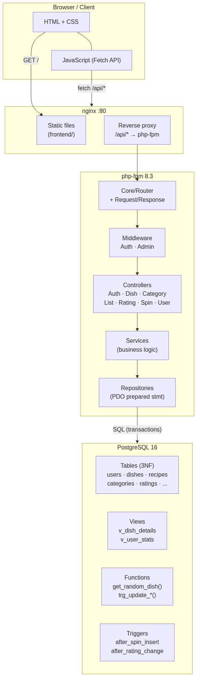
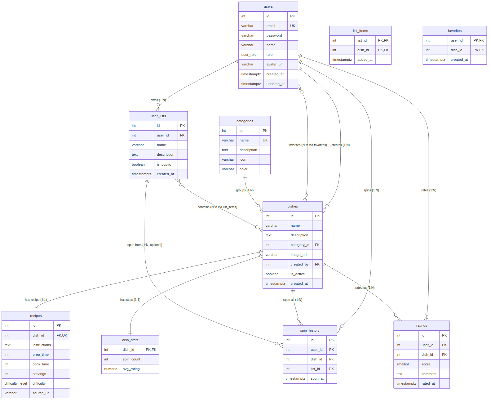

# Spin & Eat

> *"Co dzisiaj na obiad?" — losowanie dań z animowanej karuzeli.*

Pełna aplikacja webowa zbudowana w ramach **Wstępu do Projektowania Aplikacji Internetowych**.
Bez frameworka, bez gotowych szablonów — czysty PHP 8.3 (OOP + SOLID), PostgreSQL 16, vanilla JavaScript (Fetch API), własna lekka warstwa MVC.

---

## Spis treści

- [Temat i zakres](#temat-i-zakres)
- [Stack](#stack)
- [Architektura](#architektura)
- [Baza danych](#baza-danych)
- [Uruchomienie](#uruchomienie)
- [Konta testowe](#konta-testowe)
- [Funkcjonalności](#funkcjonalności)
- [Role i uprawnienia](#role-i-uprawnienia)
- [Bezpieczeństwo](#bezpieczeństwo)
- [Testy](#testy)
- [Scenariusz testowy (krok po kroku)](#scenariusz-testowy-krok-po-kroku)
- [Zrzuty ekranu](#zrzuty-ekranu)
- [Struktura repozytorium](#struktura-repozytorium)
- [Checklista wymagań](#checklista-wymagań)

---

## Temat i zakres

**Problem:** codzienne "co zjeść?" potrafi blokować obiad bardziej niż brak składników w lodówce.
**Rozwiązanie:** spersonalizowana karuzela losująca (styl "case-opening" znany z CS:GO) — użytkownik zbiera bazę dań (własne + społeczność), filtruje po kategoriach lub własnych listach, odpala losowanie i dostaje decyzję podaną w przyjemnej formie. Po posiłku może ocenić danie, dodać do ulubionych i podejrzeć historię losowań.

**Zakres MVP:**

- Rejestracja / logowanie / wylogowanie z sesją.
- Katalog dań z kategoriami (CRUD, role).
- Własne listy dań (N:M z daniami), prywatne lub publiczne.
- Mechanizm losowania z opcjonalnym filtrem po kategorii lub liście.
- Historia spinów, ulubione, oceny (1–5 + komentarz).
- Panel administratora (użytkownicy + kategorie).

---

## Stack

| Warstwa     | Technologia                                                    |
|-------------|----------------------------------------------------------------|
| Frontend    | HTML5 + CSS3 (custom design system, media queries), vanilla JS, Fetch API |
| Backend     | PHP 8.3 (OOP, SOLID), własny router + middleware              |
| Baza danych | PostgreSQL 16 (widoki, triggery, funkcje, transakcje)         |
| Web serwer  | nginx (proxy /api → php-fpm, statyki frontend)                |
| Konteneryzacja | Docker + docker-compose                                     |
| Testy       | PHPUnit + integracyjny skrypt curl                            |

Brak framework'ów (Symfony / Laravel) i gotowych szablonów (Bootstrap / Tailwind) — zgodnie z regulaminem.

---

## Architektura



Aplikacja jest dwuwarstwowa: frontend (SPA) i backend (JSON API). Komunikacja przez `fetch()` z plikami statycznymi serwowanymi przez nginx, requestami `/api/*` proxy'owanymi do php-fpm. Sesja użytkownika trzymana w cookie `SPINNEAT_SID` (HttpOnly + SameSite=Lax + Secure-on-HTTPS), CSRF token w nagłówku `X-CSRF-Token`.

**Backend** podzielony jest na klasyczne warstwy:

```
public/index.php   → bootstrap
Core/Application   → konfiguracja routera
Core/Router        → match + middleware pipeline
Core/Middleware    → Auth · Admin · Csrf
Controllers/*      → walidacja i HTTP response
Services/*         → logika biznesowa, transakcje
Repositories/*     → SQL przez PDO (prepared statements)
Models/*           → POPO + toPublicArray()
```

Szczegóły: [`docs/database.md`](docs/database.md).

---

## Baza danych

PostgreSQL 16 w 3NF.



**Wszystkie typy relacji:**

- **1:1** — `dishes` ↔ `recipes`, `dishes` ↔ `dish_stats`.
- **1:N** — `categories` → `dishes`, `users` → `user_lists / spin_history / ratings / dishes (created_by)`.
- **N:M** — `users` ↔ `dishes` (`favorites`), `user_lists` ↔ `dishes` (`list_items`).

**Obiekty bazodanowe:**

- **2 widoki**: `v_dish_details` (joinuje dishes ⋈ categories ⋈ recipes ⋈ dish_stats ⋈ users), `v_user_stats` (agregat z aktywności użytkownika).
- **2 triggery**: `after_spin_insert` (utrzymuje `dish_stats.spin_count`), `after_rating_change` (utrzymuje `dish_stats.avg_rating`).
- **3 funkcje** plpgsql: `get_random_dish(p_list_id)` plus dwie procedury triggerów.
- **Transakcje**: `SpinService::spin()` losuje danie i zapisuje do historii w jednej transakcji (`READ COMMITTED`).
- **Akcje na FK**: `CASCADE` / `RESTRICT` / `SET NULL` — pełna mapa w [`docs/database.md`](docs/database.md).

**Eksport**: jeden plik `database/exports/spinneat_full.sql` zawiera kompletny schemat + przykładowe dane, zawinięte w transakcję.

---

## Uruchomienie

**Wymagania:** Docker 24+ i docker-compose v2.

```bash
git clone https://github.com/wokapala/spinneat.git
cd spinneat
cp .env.example .env          # uzupełnij hasła jeśli zmieniasz domyślne
docker compose up -d
```

Pierwsze uruchomienie:

- pobiera obrazy nginx / php / postgres,
- uruchamia composer install w kontenerze php,
- odpala migrację schematu z `database/schema.sql` + seed z `database/seed.sql`.

Aplikacja dostępna pod **<http://localhost>** (port 80 z `.env.example`; ustaw `NGINX_PORT=8080` jeśli 80 jest zajęte), API pod **<http://localhost/api>**.

### Zmienne środowiskowe

Plik [`.env.example`](.env.example) zawiera wszystkie wymagane zmienne — najważniejsze:

| Zmienna       | Opis                                | Domyślnie         |
|---------------|-------------------------------------|-------------------|
| `APP_ENV`     | `development` / `production`        | `development`     |
| `DB_HOST`     | host bazy danych                    | `db`              |
| `DB_PORT`     | port bazy                           | `5432`            |
| `DB_NAME`     | nazwa bazy                          | `spinneat`        |
| `DB_USER`     | użytkownik DB                       | `spinneat`        |
| `DB_PASS`     | hasło DB                            | (ustaw w `.env`)  |
| `NGINX_PORT`  | port HTTP gospodarza                | `80`              |
| `APP_SECRET`  | sól dla aplikacji (na przyszłość)   | (ustaw w `.env`)  |

W produkcji `APP_ENV=production` wyłącza wyświetlanie błędów PHP i włącza flagę `Secure` na cookie sesyjnym.

### Załadowanie pełnego dumpu (alternatywnie do schema + seed)

```bash
docker compose exec -T postgres psql -U spinneat -d spinneat \
  < database/exports/spinneat_full.sql
```

---

## Konta testowe

Wszystkie konta z seedu używają hasła **`Admin1234!`**.

| Email                  | Rola  | Co umożliwia                                           |
|------------------------|-------|--------------------------------------------------------|
| `admin@spinneat.local` | admin | pełny dostęp + panel /admin (zarządzanie userami i kategoriami) |
| `jan@example.com`      | user  | własne dania, listy, ulubione, oceny, historia         |
| `anna@example.com`     | user  | jw. — drugi przykładowy user                            |

---

## Funkcjonalności

- **Karuzela losująca** — poziomy pasek kart z animacją "case-opening", wskaźnik zatrzymuje się dokładnie na daniu wylosowanym przez backend, filtry "kategoria" i "lista".
- **Katalog dań** — wyszukiwarka, chipsy kategorii, dodawanie własnych dań.
- **Listy** — własne kolekcje dań do losowania, opcjonalnie publiczne.
- **Ulubione** — szybkie zapisywanie na osi serca.
- **Historia spinów** — paginowana lista, oceny "in place".
- **Oceny** — 1–5 gwiazdek + komentarz, jedna ocena na (user, dish).
- **Profil** — statystyki i skróty do sekcji.
- **Panel administratora** — promowanie / degradowanie userów, usuwanie userów, CRUD kategorii.

---

## Role i uprawnienia

System ma trzy role: `guest`, `user`, `admin` (enum w PostgreSQL).

| Operacja                            | guest | user | admin |
|-------------------------------------|:-----:|:----:|:-----:|
| Przeglądanie dań i kategorii        | ✅    | ✅   | ✅    |
| Logowanie / rejestracja             | ✅    | —    | —     |
| Spin / historia / ulubione / oceny  | —     | ✅   | ✅    |
| Tworzenie dań                       | —     | ✅   | ✅    |
| Edycja / kasowanie własnych dań     | —     | ✅   | ✅    |
| Edycja / kasowanie cudzych dań      | —     | ❌   | ✅    |
| CRUD kategorii                      | —     | —    | ✅    |
| Zarządzanie userami                 | —     | —    | ✅    |

Uprawnienia egzekwowane na trzech poziomach: middleware (`AuthMiddleware`, `AdminMiddleware`), kontroler (`assertOwnerOrAdmin()`) i serwis (spin tylko z własnej lub publicznej listy). Niezalogowany dostęp do chronionego endpointu zwraca **401**, zalogowany bez uprawnień — **403** (UI pokazuje komunikat). Przyjazne strony błędów 400/401/403/404/500 są dostępne pod `/errors/*.html` i podpięte w nginx przez `error_page`.

---

## Bezpieczeństwo

Mapa zabezpieczeń względem "PHP Security Bingo":

| Pole | Mechanizm                                  | Gdzie               |
|------|--------------------------------------------|---------------------|
| A1   | Prepared statements (PDO `?`)              | wszystkie repo      |
| A2   | POST-only dla logowania/rejestracji        | Application routes  |
| A3   | Hasła nigdy w logach (tylko email + IP)    | AuthService         |
| A4   | Rate limit logowania (5/15min/email)       | AuthService         |
| A5   | Sensowne kody HTTP (400/401/403/404/422/500) | Exceptions       |
| B1   | Neutralny komunikat błędu logowania        | AuthService         |
| B2   | CSRF token w wszystkich POST/PUT/DELETE    | CsrfMiddleware      |
| B3   | `session_regenerate_id(true)` po logowaniu | AuthService         |
| B4   | Walidacja złożoności hasła (litera + cyfra)| AuthService         |
| B5   | Hasło nigdy w odpowiedzi z `me`            | User::toPublicArray |
| C1   | `filter_var(... FILTER_VALIDATE_EMAIL)`    | AuthService         |
| C2   | CSRF token przy rejestracji                | CsrfMiddleware      |
| C3   | Cookie `HttpOnly`                          | index.php           |
| C4   | Anti-enumeracja przy rejestracji           | AuthService         |
| C5   | Minimalny zestaw danych z DB               | repozytoria         |
| D1   | DI przez konstruktor (testowalne)          | wszystkie serwisy   |
| D2   | Limity długości wejścia (maxlength + max:N)| Frontend + BaseCtrl |
| D3   | Cookie `Secure` (gdy HTTPS)                | index.php           |
| D4   | `esc()` w `innerHTML` (anty-XSS)           | frontend/js/app.js  |
| D5   | `session_destroy()` + skasowanie cookie    | AuthService         |
| E1   | CSP + HTTPS redirect (gotowe do prod)      | nginx               |
| E2   | `password_hash(BCRYPT, cost=12)`           | AuthService         |
| E3   | Cookie `SameSite=Lax`                      | index.php           |
| E4   | `display_errors=0` w prod                  | index.php           |
| E5   | Audit log nieudanych logowań               | AuthService         |

Dodatkowo w nginx: `X-Frame-Options`, `X-Content-Type-Options`, `X-XSS-Protection`, `Referrer-Policy`, `Permissions-Policy`, `Content-Security-Policy`, blokada dotfiles.

---

## Testy

**Unit** — PHPUnit w `backend/tests/Unit/`:

```bash
docker compose exec php vendor/bin/phpunit --testdox
```

- `AuthServiceTest` — walidacja rejestracji (hasło, email, duplikaty), trimowanie wejścia.
- `SpinServiceTest` — transakcja spinów (commit/rollback), uprawnienia do list (403 na cudzą prywatną listę).
- `CsrfTest` — generowanie i weryfikacja tokenu CSRF.

**Integracyjne** — `backend/tests/Integration/endpoints.sh`:

```bash
bash backend/tests/Integration/endpoints.sh
```

Sprawdza: pełny rejestracja → login → spin → ocena flow + dostęp do endpointów admina (oczekiwany 403 dla zwykłego usera).

---

## Scenariusz testowy (krok po kroku)

1. **Uruchomienie** — `docker compose up -d` → `http://localhost` (lub port z `NGINX_PORT`) → widoczna strona "What's for dinner?" (guest hero).
2. **Rejestracja** — klik "Zacznij teraz" → wypełnij email/hasło/imię (hasło min. 8 znaków + litera + cyfra) → konto utworzone, auto-login → przekierowanie do home z karuzelą.
3. **Spin** — w dropdownie "Wszystkie" zostaw domyślne → klik **SPIN!** → karuzela przejeżdża ~5–6 sekund z mocnym wyhamowaniem i zatrzymuje się na konkretnym daniu → karta wyniku **dokładnie zgadza się** z kartą pod wskaźnikiem.
4. **Filtr na kategorię** — wybierz "Polska" w pierwszym dropdownie → karty karuzeli momentalnie aktualizują się na polskie dania → kolejny spin tylko z tej puli.
5. **Filtr na własną listę** — przejdź do *Lists* → utwórz listę "Moje weekendy" → dodaj kilka dań przez "+ Dodaj danie" → wróć do home → w drugim dropdownie wybierz tę listę → spin losuje tylko z listy.
6. **Ulubione** — w *Meals* otwórz danie → "❤️ Dodaj do ulubionych" → w sekcji *Favorites* danie się pojawia (toast "Dodano").
7. **Ocena** — po spinie klik "Oceń danie" → wybierz 5★ + komentarz → "Zapisz" → wracając do tego dania widać średnią.
8. **Historia** — *History* → lista poprzednich spinów + statystyka "Total spins".
9. **Test uprawnień (403)** — w *Profile* "Wyloguj się" → zaloguj jako `jan@example.com` (zwykły user) → próba dostępu do `/api/admin/users` zwraca **403**, UI nie pokazuje przycisku panelu.
10. **Test uprawnień (401)** — wyloguj się → próba wejścia w `/api/spin` (POST) → zwraca **401**.
11. **Login throttle** — wpisz złe hasło 5× pod rząd dla tego samego maila → 6. próba zwraca komunikat *"Too many failed attempts. Try again in N seconds."*
12. **CSRF** — w devtools usuń nagłówek `X-CSRF-Token` z dowolnego POST → odpowiedź **403** *"CSRF token missing or invalid"*.
13. **XSS** — utwórz danie o nazwie `<script>alert(1)</script>` → tekst wyświetla się jako zwykłe znaki, alert się nie odpala (escapowane w `app.js::esc()`).
14. **Panel admin** — zaloguj `admin@spinneat.local` → *Profile* → "Panel administratora" → promuj / degraduj usera → potwierdzone w bazie (widok `v_user_stats`).
15. **Wyzwalacz** — wykonaj spin → sprawdź w bazie `SELECT * FROM dish_stats WHERE dish_id = <id>` → `spin_count` zwiększony o 1.
16. **Funkcja** — `SELECT * FROM get_random_dish(NULL);` w psql → zwraca jeden losowy aktywny rekord.
17. **Akcje na referencjach (RESTRICT)** — jako admin spróbuj usunąć kategorię, która ma dania → **409** *"Cannot delete a category that still has dishes"* (FK `ON DELETE RESTRICT`). Kategoria bez dań usuwa się poprawnie.
18. **Uprawnienia do list** — `POST /api/spin` z `list_id` prywatnej listy innego użytkownika → **403**; lista publiczna innego użytkownika → losuje normalnie.

---

## Zrzuty ekranu

> Zrzuty znajdują się w `docs/screenshots/` (wersja **WEBOWA** i **MOBILNA**).

```
docs/screenshots/
├── home-desktop.png        home-mobile.png
├── dishes-desktop.png      dishes-mobile.png
├── lists-desktop.png       lists-mobile.png
├── history-desktop.png     history-mobile.png
├── profile-desktop.png     profile-mobile.png
└── admin-desktop.png       admin-mobile.png
```

---

## Struktura repozytorium

```
spinneat/
├── backend/
│   ├── public/index.php          # bootstrap PHP-FPM
│   ├── src/
│   │   ├── Controllers/          # warstwa HTTP
│   │   ├── Core/                 # Router, Request, Response, Csrf, Middleware
│   │   ├── Exceptions/           # AppException + warianty
│   │   ├── Models/               # User itp.
│   │   ├── Repositories/         # PDO + prepared statements
│   │   └── Services/             # logika biznesowa, transakcje
│   └── tests/
│       ├── Unit/                 # PHPUnit (AuthService, SpinService)
│       └── Integration/          # endpoints.sh
├── database/
│   ├── schema.sql                # tabele, widoki, triggery, funkcje, indeksy
│   ├── seed.sql                  # przykładowe dane
│   └── exports/spinneat_full.sql # pełny dump w jednym pliku
├── docs/
│   ├── architecture.mmd / .png   # diagram warstwowy
│   ├── erd.mmd / .png            # ERD
│   ├── database.md               # opis bazy
│   └── screenshots/              # screeny (web + mobile)
├── frontend/
│   ├── index.html                # SPA shell
│   ├── css/                      # variables, main, components, responsive
│   ├── js/
│   │   ├── api.js                # warstwa Fetch + CSRF
│   │   ├── auth.js               # stan sesji
│   │   ├── wheel.js              # karuzela losująca (case-opening)
│   │   ├── app.js                # router SPA, Toast, Modal, esc()
│   │   └── pages/                # home, dishes, lists, login, …
│   └── errors/                   # 400/401/403/404/500.html
├── nginx/default.conf            # proxy + security headers
├── docker-compose.yml
└── .env.example
```

---

## Checklista wymagań

| Kategoria                                                       | Status |
|-----------------------------------------------------------------|:------:|
| DOKUMENTACJA W README (opisy, flow, screeny)                    | ✅     |
| DOCKER                                                          | ✅     |
| ARCHITEKTURA MVC / FRONT-BACKEND                                | ✅     |
| KOD NAPISANY OBIEKTOWO (część backendowa)                       | ✅     |
| DIAGRAM ERD                                                     | ✅     |
| GIT (systematyka commitów, całość zmergowana do `main`)         | ✅     |
| REALIZACJA TEMATU                                               | ✅     |
| HTML                                                            | ✅     |
| POSTGRESQL                                                      | ✅     |
| ZŁOŻONOŚĆ BAZY DANYCH (1:1, 1:N, N:M)                           | ✅     |
| EKSPORT BAZY DO PLIKU .SQL                                      | ✅     |
| PHP                                                             | ✅     |
| JAVA SCRIPT                                                     | ✅     |
| FETCH API (AJAX)                                                | ✅     |
| DESIGN                                                          | ✅     |
| RESPONSYWNOŚĆ (media queries: 360 / 480 / 641 / 768)            | ✅     |
| LOGOWANIE                                                       | ✅     |
| SESJA UŻYTKOWNIKA                                               | ✅     |
| UPRAWNIENIA UŻYTKOWNIKÓW                                        | ✅     |
| ROLE UŻYTKOWNIKÓW (≥ 2: guest, user, admin)                     | ✅     |
| WYLOGOWYWANIE                                                   | ✅     |
| WIDOKI / WYZWALACZE / FUNKCJE / TRANSAKCJE                      | ✅     |
| AKCJE NA REFERENCJACH                                           | ✅     |
| BEZPIECZEŃSTWO (CSRF, XSS, sesje, rate limit, headers, CSP)     | ✅     |
| BRAK REPLIKACJI KODU                                            | ✅     |
| CZYSTOŚĆ I PRZEJRZYSTOŚĆ KODU                                   | ✅     |
